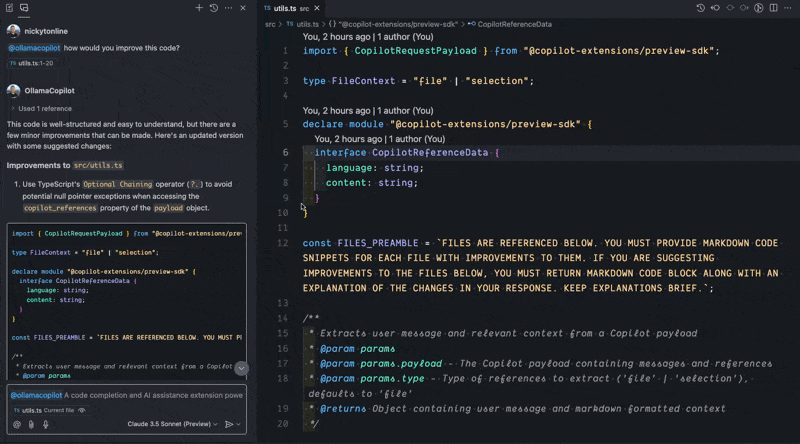

# A Copilot Extension that Leverages Ollama

This is a Copilot extension that leverages the Ollama API. This is a WIP and currently works only in a local development environment. You must have [Ollama](https://ollama.com/) running locally.

It can work deployed, but it would require being able to access your Ollama API at a public address.



## Installation

1. Ensure that [Ollama](https://ollama.com/) is running locally.
2. Install the `codellama` model if you haven't already. You can do this by running the following command in your terminal:

```bash
ollama pull codellama
```

3. Run the following commands to install and start the application locally

```bash
npm install
npm run dev
open http://localhost:3000
```

## Development Environment

To get up and running with your development environment, see the [Development Guide](./docs/DEVELOPMENT_SETUP.md).
